<div align="center">

# Sentra Smartboard Semayot

### Operational command center for Semayot owners, staff, outlets, data, and AI

<p>
  
  
  
  
  
</p>

<p>
  <strong>Sentra Smartboard</strong> is the operational decision center for Semayot.
  It turns sales, inventory, cashier activity, customer signals, reports, and AI summaries into clear daily priorities that owners and staff can act on immediately.
</p>

<p>
  
</p>

</div>

---

## Executive Summary

Sentra Smartboard Semayot is the command-center layer for Rumah Makan Semayot.
It is not positioned as a simple restaurant website. It is an operational work
system that connects four surfaces inside one codebase:

1. **Owner/staff Smartboard** at `/admin/overview`
2. **Admin Workspace** for menu, POS, transactions, reports, customers, SEO, and
   settings
3. **AI + Intelligence Layer** for business summaries, owner consultation,
   memory, priorities, and public chat
4. **Public Restaurant Site** as the brand entry point and customer conversation
   surface

This README intentionally focuses on **Sentra Smartboard**, because that is
where Semayot's daily decisions are formed: operational numbers are read, risks
are surfaced, priorities are selected, AI explains context, and the owner or
staff moves into the right action surface.

---

## Product Thesis

> A good dashboard does not merely show numbers. A correct dashboard helps the
> owner take the right action on the same day.

Sentra Smartboard is built to answer four operational questions:

| Owner Question                           | Smartboard Answer                                                           |
| ---------------------------------------- | --------------------------------------------------------------------------- |
| How is the outlet performing today?      | `Nadi Outlet`, KPIs, transactions, cashier closing, and data status         |
| What needs to be handled first?          | `Today's Priorities`, `Stock Risk Radar`, and deterministic recommendations |
| Which risks must not be missed?          | critical stock, unsafe closing, weak transactions, missing data             |
| How can AI help without inventing facts? | SEMA Daily Brief, quick prompts, owner chat, public chat, memory inbox      |

---

## Sentra Design Language

The README and product direction follow the **Sentra Smartboard** language:
warm, tactical, operational, and precise.

| Element         | Sentra Direction                                             |
| --------------- | ------------------------------------------------------------ |
| Visual tone     | Warm operational command center                              |
| Background      | Blush-pink, warm-neutral, and high-contrast cards            |
| Accent          | Coral, rose, amber, violet, sky, emerald                     |
| Typography      | Strong display headlines, mono labels for status and signals |
| Component shape | Flat boxes, tactical chips, command-center cards             |
| Motion          | Used for orientation and emphasis, not empty decoration      |
| AI posture      | Helps the owner think; does not replace business judgment    |

---

## Table of Contents

- [Executive Summary](#executive-summary)
- [Product Thesis](#product-thesis)
- [Sentra Design Language](#sentra-design-language)
- [System Map](#system-map)
- [Smartboard Command Loop](#smartboard-command-loop)
- [Product Surfaces](#product-surfaces)
- [Smartboard Modules](#smartboard-modules)
- [AI and Intelligence Boundary](#ai-and-intelligence-boundary)
- [Data Truth Model](#data-truth-model)
- [Role and Access Boundary](#role-and-access-boundary)
- [Route Map](#route-map)
- [Architecture Folder Map](#architecture-folder-map)
- [Local Runbook](#local-runbook)
- [Environment Variables](#environment-variables)
- [Testing and Governance](#testing-and-governance)
- [Most Important Files](#most-important-files)
- [Product Truth Principles](#product-truth-principles)

---

## System Map

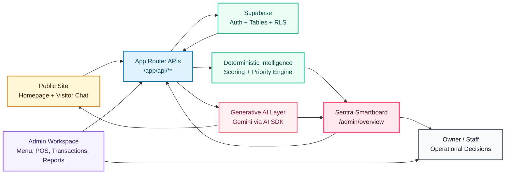

---

## Smartboard Command Loop

Sentra Smartboard is not a static dashboard. It is a decision loop.

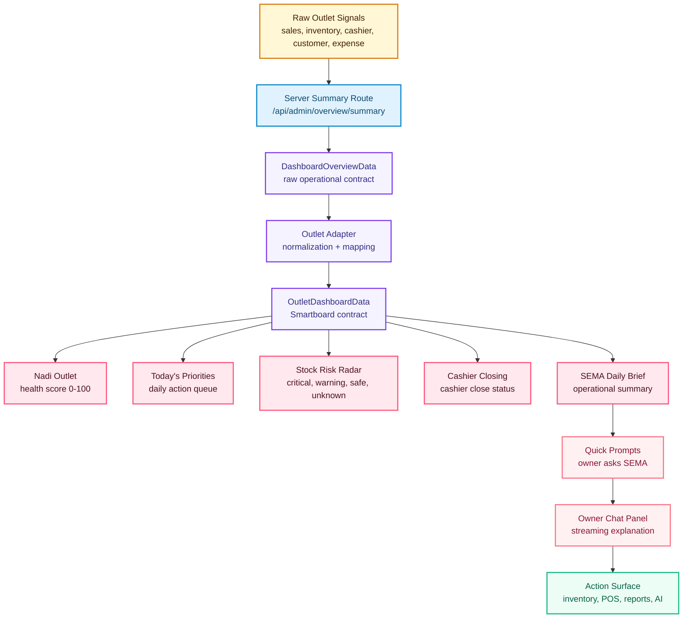

---

## Product Surfaces

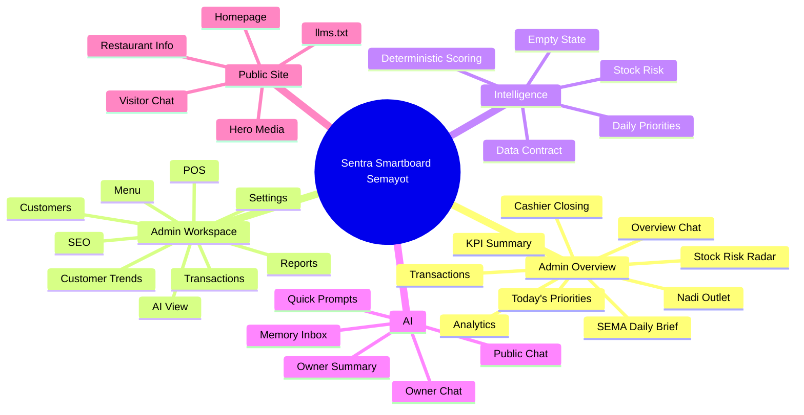

---

## Smartboard Module Topology

```mermaid
flowchart TB
    Page["Overview Page Client<br/>Smartboard Shell"]

    Hero["OverviewHero<br/>operator greeting"]
    KPIs["OverviewKpis<br/>sales, transactions, AOV, satisfaction"]
    Health["OutletHealthCard<br/>Nadi Outlet"]
    Priority["TodayPriorityPanel<br/>daily action queue"]
    Stock["StockRiskRadar<br/>inventory risk"]
    Brief["SemaDailyBrief<br/>SEMA action brief"]
    Closing["CashierClosingAssistant<br/>cashier close state"]
    Chat["OverviewChatPanel<br/>owner/staff consultation"]
    Analytics["OverviewAnalytics<br/>operational charts"]
    Transactions["OverviewTransactions<br/>latest activity"]
    Sidebar["OverviewSidebar<br/>user + outlet context"]
    Badge["DashboardModeBadge<br/>live, demo, empty"]
    Empty["SmartEmptyState<br/>honest fallback"]

    Page --> Hero
    Page --> KPIs
    Page --> Health
    Page --> Priority
    Page --> Stock
    Page --> Brief
    Page --> Closing
    Page --> Chat
    Page --> Analytics
    Page --> Transactions
    Page --> Sidebar
    Page --> Badge
    Page --> Empty

    classDef page fill:#111827,stroke:#FF4F79,color:#FFFFFF,stroke-width:3px;
    classDef primary fill:#FFE8EE,stroke:#FF4F79,color:#4A1020,stroke-width:2px;
    classDef metric fill:#E0F2FE,stroke:#0284C7,color:#0C4A6E,stroke-width:2px;
    classDef action fill:#ECFDF5,stroke:#10B981,color:#065F46,stroke-width:2px;
    classDef ai fill:#FFF1F2,stroke:#FB7185,color:#881337,stroke-width:2px;
    classDef support fill:#F5F3FF,stroke:#8B5CF6,color:#2D1B69,stroke-width:2px;
    classDef fallback fill:#F8FAFC,stroke:#64748B,color:#334155,stroke-width:2px;

    class Page page;
    class Hero,Health,Priority,Stock,Closing primary;
    class KPIs,Analytics,Transactions metric;
    class Brief,Chat ai;
    class Sidebar,Badge support;
    class Empty fallback;
```

---

## Smartboard Modules

| Module                    | Function                          | Data Source                         | Output                                    | Guardrail                       |
| ------------------------- | --------------------------------- | ----------------------------------- | ----------------------------------------- | ------------------------------- |
| `OverviewHero`            | Opens operator and outlet context | session + outlet                    | greeting, role, mode                      | does not show business claims   |
| `OverviewKpis`            | Summarizes outlet performance     | sales + transactions                | revenue, orders, AOV, satisfaction signal | numbers must come from summary  |
| `OutletHealthCard`        | Scores outlet health              | outlet contract                     | 0-100 score + reasons                     | deterministic only              |
| `TodayPriorityPanel`      | Builds today's action queue       | health + stock + cashier + activity | operational priority list                 | does not invent priorities      |
| `StockRiskRadar`          | Reads stock risk                  | inventory                           | critical/warning/safe/unknown             | unknown remains unknown         |
| `CashierClosingAssistant` | Checks cashier closing            | cashier/shift data                  | closing status                            | never assumes safe without data |
| `SemaDailyBrief`          | Summarizes operational actions    | deterministic summary               | brief + quick prompts                     | not a fake business diagnosis   |
| `OverviewChatPanel`       | Owner/staff dialogue with SEMA    | context + prompt                    | streaming answer                          | role-aware, context-bound       |
| `OverviewAnalytics`       | Visualizes operations             | summary data                        | chart/graph                               | visuals must not overstate data |
| `OverviewTransactions`    | Shows recent activity             | transactions                        | latest activity                           | follows transaction data        |
| `DashboardModeBadge`      | Marks data mode                   | app state                           | live/demo/empty                           | mode must be visible            |
| `SmartEmptyState`         | Honest fallback                   | missing data                        | empty state                               | no fake metrics                 |

---

## AI and Intelligence Boundary

This separation is a core Semayot principle: not every intelligent behavior
should come from an LLM.

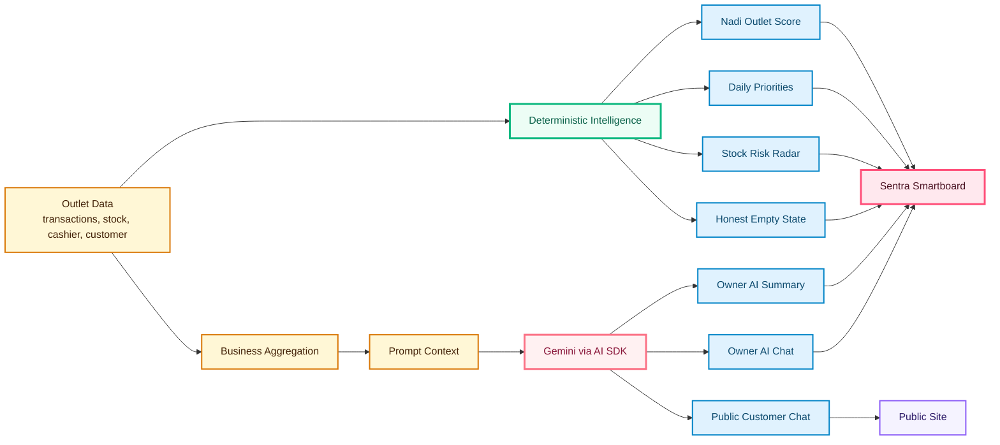

### Deterministic Intelligence

Primary locations:

- [`lib/admin/overview/intelligence.ts`](lib/admin/overview/intelligence.ts)
- [`lib/admin/overview/outlet-contracts.ts`](lib/admin/overview/outlet-contracts.ts)
- [`lib/admin/overview/outlet-adapter.ts`](lib/admin/overview/outlet-adapter.ts)

Responsibilities:

- Calculate **Nadi Outlet** from transactions, inventory, cashier closing,
  cashier activity, menu movement, and anomaly placeholders
- Classify stock risk into `critical`, `warning`, `safe`, or `unknown`
- Build daily operational priorities
- Generate **SEMA Daily Brief** while remaining honest when data is incomplete
- Produce empty states that do not invent data

Strengths:

- fast
- deterministic
- testable
- not token-dependent
- suitable for core dashboard logic

### Generative AI Layer

Primary locations:

- [`app/api/chat/route.ts`](app/api/chat/route.ts)
- [`app/api/admin/ai/chat/route.ts`](app/api/admin/ai/chat/route.ts)
- [`app/api/admin/ai/summary/route.ts`](app/api/admin/ai/summary/route.ts)
- [`app/api/admin/ai/memory/route.ts`](app/api/admin/ai/memory/route.ts)
- [`lib/admin/ai/aggregate.ts`](lib/admin/ai/aggregate.ts)
- [`lib/admin/ai/prompts.ts`](lib/admin/ai/prompts.ts)
- [`lib/semayot/chat-system-prompt.ts`](lib/semayot/chat-system-prompt.ts)

Responsibilities:

- Answer customer questions on the public site
- Generate owner business summaries by period
- Run owner chat using bounded context
- Read and mark memory inbox items
- Turn Smartboard quick prompts into operational dialogue

Guardrails:

- owner AI is limited to the owner role
- public chat must not invent restaurant information
- summaries require an API key
- cache is preferred before regeneration
- deterministic signals must not be disguised as LLM output
- LLM output must not replace source numbers

---

## Data Truth Model

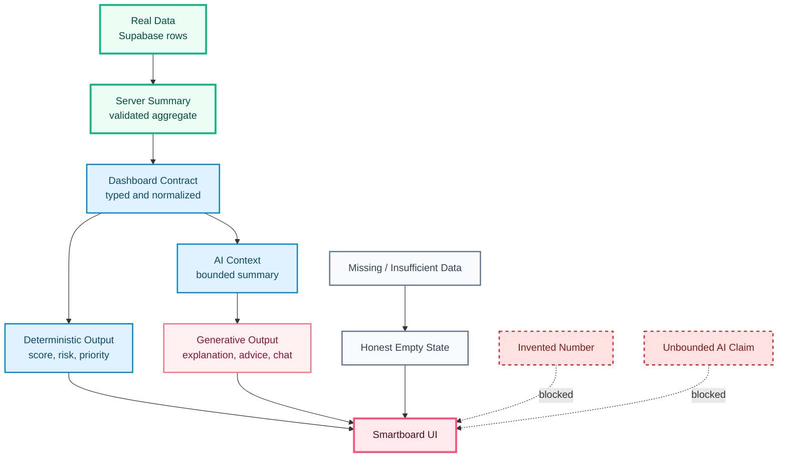

### Truth Levels

| Level | Name                       | Source                  | Can Be Displayed?      | Notes                                |
| ----- | -------------------------- | ----------------------- | ---------------------- | ------------------------------------ |
| L0    | Raw data                   | Supabase tables         | only through aggregate | should not directly become UI claims |
| L1    | Server summary             | API route               | yes                    | primary operational numbers          |
| L2    | Dashboard contract         | adapter + type contract | yes                    | safe shape for UI                    |
| L3    | Deterministic intelligence | scoring/rules           | yes                    | must be testable                     |
| L4    | Generative AI              | Gemini                  | yes, with AI label     | must not replace data                |
| L5    | Missing data               | null/empty/unknown      | yes                    | display as empty/unknown             |
| L6    | Invented data              | no source               | no                     | must be blocked                      |

---

## Role and Access Boundary

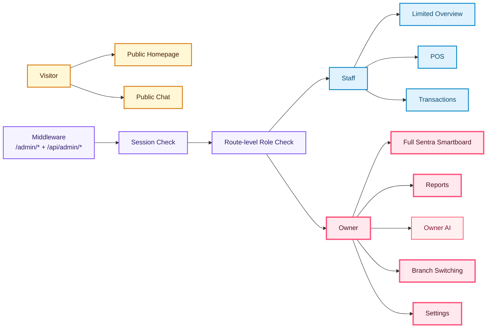

| Role    | Surface                                        | Access                                      |
| ------- | ---------------------------------------------- | ------------------------------------------- |
| Visitor | Homepage + public chat                         | restaurant information and hospitality chat |
| Staff   | overview subset, cashier, transactions         | limited daily operations                    |
| Owner   | full Smartboard, reports, AI, branch, settings | full decision and administration access     |

---

## Route Map

```mermaid
flowchart TB
    Root["semayot app"] --> Admin["/admin"]
    Root --> Public["/"]
    Root --> API["/api"]

    Admin --> Login["/admin/login"]
    Admin --> Overview["/admin/overview"]
    Admin --> Menu["/admin/menu"]
    Admin --> POS["/admin/pos"]
    Admin --> Tx["/admin/transactions"]
    Admin --> Reports["/admin/reports"]
    Admin --> Customers["/admin/customers"]
    Admin --> Trends["/admin/customers/trends"]
    Admin --> AIPage["/admin/ai"]
    Admin --> SEO["/admin/seo"]
    Admin --> Settings["/admin/settings"]

    API --> PublicChat["/api/chat"]
    API --> AdminAPI["/api/admin"]
    AdminAPI --> OverviewSummary["/api/admin/overview/summary"]
    AdminAPI --> AIChat["/api/admin/ai/chat"]
    AdminAPI --> AISummary["/api/admin/ai/summary"]
    AdminAPI --> AIMemory["/api/admin/ai/memory"]
    AdminAPI --> Branches["/api/admin/branches"]
    AdminAPI --> MenuAPI["/api/admin/menu"]
    AdminAPI --> POSAPI["/api/admin/pos"]
    AdminAPI --> TxAPI["/api/admin/transactions"]
    AdminAPI --> ReportsDaily["/api/admin/reports/daily"]
    AdminAPI --> ReportsMonthly["/api/admin/reports/monthly"]
    AdminAPI --> ReportsExport["/api/admin/reports/export"]

    classDef root fill:#111827,stroke:#FF4F79,color:#FFFFFF,stroke-width:3px;
    classDef public fill:#FFF7D6,stroke:#D97706,color:#422006,stroke-width:2px;
    classDef admin fill:#FFE8EE,stroke:#FF4F79,color:#4A1020,stroke-width:2px;
    classDef api fill:#E0F2FE,stroke:#0284C7,color:#0C4A6E,stroke-width:2px;
    classDef ai fill:#FFF1F2,stroke:#FB7185,color:#881337,stroke-width:2px;
    classDef reports fill:#ECFDF5,stroke:#10B981,color:#065F46,stroke-width:2px;

    class Root root;
    class Public,PublicChat public;
    class Admin,Login,Overview,Menu,POS,Tx,Reports,Customers,Trends,SEO,Settings admin;
    class API,AdminAPI,OverviewSummary,Branches,MenuAPI,POSAPI,TxAPI api;
    class AIPage,AIChat,AISummary,AIMemory ai;
    class ReportsDaily,ReportsMonthly,ReportsExport reports;
```

---

## Admin Workspace

Smartboard is the decision center. Workspace pages are the execution surfaces.

| Route                     | Function                         | Relation to Smartboard                                |
| ------------------------- | -------------------------------- | ----------------------------------------------------- |
| `/admin/menu`             | manage menu                      | action surface for menu performance and stock signals |
| `/admin/pos`              | cashier and transaction workflow | direct staff execution surface                        |
| `/admin/transactions`     | transaction history              | source for latest activity                            |
| `/admin/reports`          | business reports                 | KPI drill-down                                        |
| `/admin/customers`        | customers                        | basis for retention and trends                        |
| `/admin/customers/trends` | customer trends                  | loyalty and traffic signals                           |
| `/admin/ai`               | full AI workspace                | continuation from overview chat                       |
| `/admin/seo`              | public site optimization         | brand discovery                                       |
| `/admin/settings`         | outlet configuration             | operational control                                   |

---

## Public Site

The public site remains the brand front door for Semayot, but it is not the
product's center of gravity.

| Public Surface      | Function                                   |
| ------------------- | ------------------------------------------ |
| Homepage            | introduces the restaurant brand            |
| Hero media          | builds taste and visual identity           |
| Restaurant info     | communicates outlet information            |
| Visitor chat widget | customer conversation                      |
| `llms.txt`          | information surface for AI crawlers/agents |

---

## Owner AI Summary Flow

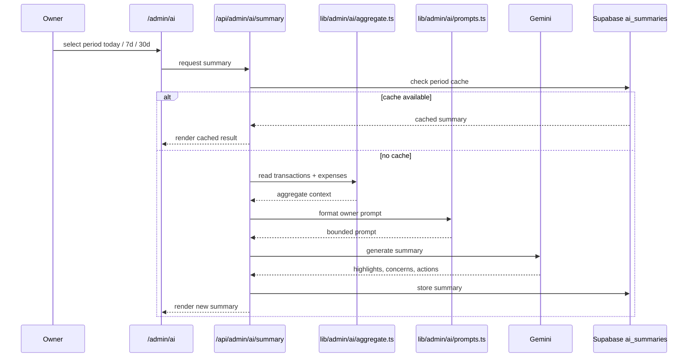

---

## Owner Chat Flow

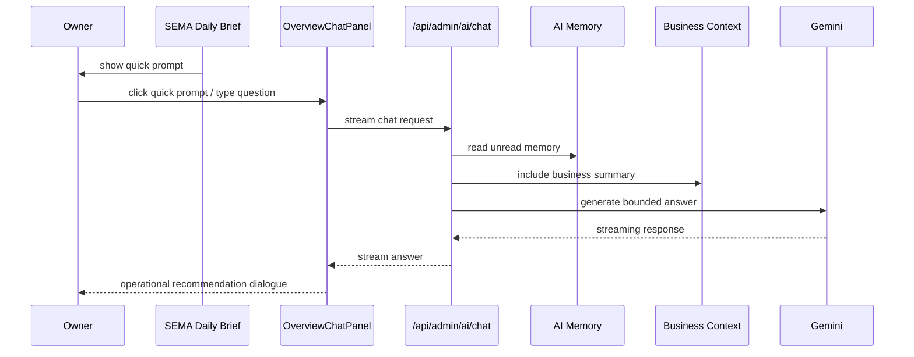

---

## Stock Risk Radar

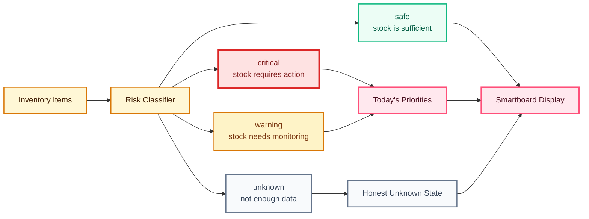

---

## Readiness State Model

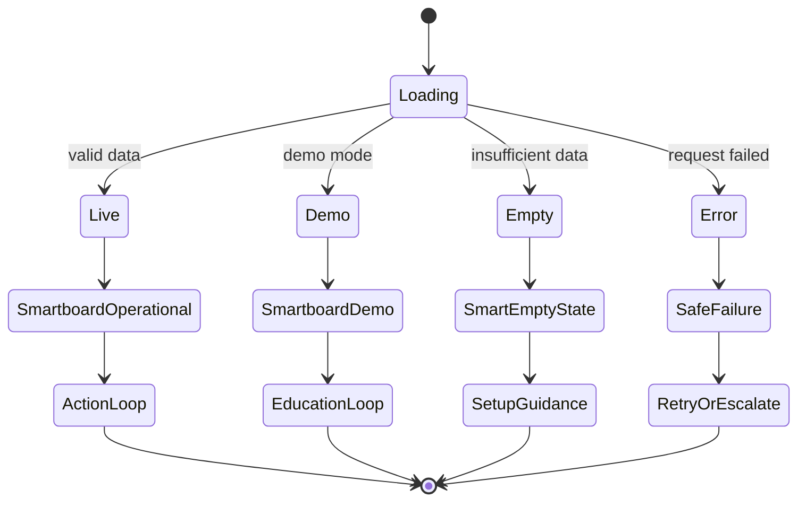

---

## Architecture Folder Map

```text
semayot/
├── app/
│   ├── admin/
│   │   ├── (authenticated)/        # active admin pages
│   │   ├── login/                  # admin login
│   │   └── layout.tsx              # admin wrapper
│   ├── api/
│   │   ├── admin/
│   │   │   ├── ai/                 # chat, summary, memory
│   │   │   ├── overview/summary/   # Smartboard loader
│   │   │   ├── reports/            # daily, monthly, export
│   │   │   ├── menu/
│   │   │   ├── pos/
│   │   │   ├── inventory/
│   │   │   ├── staff/
│   │   │   ├── customers/
│   │   │   └── branches/           # add new outlet
│   │   └── chat/                   # public customer chat
│   ├── globals.css
│   ├── layout.tsx
│   └── page.tsx
├── components/
│   ├── admin/
│   │   ├── overview/               # heart of Sentra Smartboard
│   │   └── pages/                  # admin work pages
│   ├── semayot/                    # public restaurant surface
│   └── ui/                         # utility components
├── lib/
│   ├── admin/
│   │   ├── ai/                     # prompts + AI aggregation
│   │   ├── overview/               # contracts, adapter, intelligence
│   │   ├── schemas/                # admin validation
│   │   ├── supabase/               # client + generated types
│   │   └── rls/                    # SQL/RLS artifacts
│   ├── http/                       # response/error helpers
│   └── semayot/                    # public copy and knowledge
├── public/
│   ├── semayot/images/             # public assets in use
│   ├── Chat WhatsApp.lottie
│   └── llms.txt
└── tests/
    ├── admin/overview/
    ├── admin/routes/
    ├── admin/reports/
    └── http/
```

---

## Dependency Map

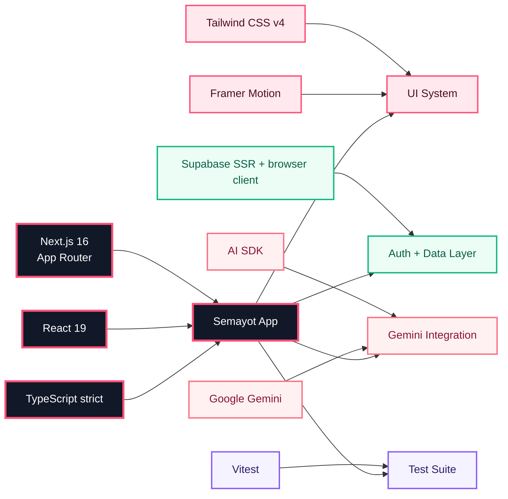

---

## Current Stack

| Layer           | Technology                    |
| --------------- | ----------------------------- |
| Framework       | Next.js 16 App Router         |
| Runtime UI      | React 19                      |
| Language        | TypeScript strict             |
| Styling         | Tailwind CSS v4               |
| Motion          | Framer Motion                 |
| Auth/Data       | Supabase SSR + browser client |
| AI              | AI SDK + Google Gemini        |
| Test            | Vitest                        |
| Package manager | pnpm only                     |

---

## Local Runbook

```bash
pnpm dev
pnpm build
pnpm start
pnpm lint
pnpm test
```

Execution notes:

- Use `pnpm`, not npm/yarn/bun.
- Admin AI and public chat require `GEMINI_API_KEY` or
  `GOOGLE_GENERATIVE_AI_API_KEY`.
- Supabase is used for auth, transactions, inventory, reports, and memory.
- Smartboard must remain safe when data is empty: show `empty` or `unknown`, not
  fake numbers.

---

## Environment Variables

| Variable                        | Required By            | Notes                                     |
| ------------------------------- | ---------------------- | ----------------------------------------- |
| `GEMINI_API_KEY`                | AI SDK / Gemini        | used for public chat and owner AI         |
| `GOOGLE_GENERATIVE_AI_API_KEY`  | alternative Gemini key | fallback according to implementation      |
| `NEXT_PUBLIC_SUPABASE_URL`      | Supabase client        | Supabase project URL                      |
| `NEXT_PUBLIC_SUPABASE_ANON_KEY` | browser client         | anon key governed by RLS                  |
| `SUPABASE_SERVICE_ROLE_KEY`     | server-only operations | must never be exposed to client           |
| `NEXT_PUBLIC_APP_URL`           | app runtime            | base URL for routes/callbacks when needed |

> Actual variable names must follow the current `.env.example` or deployment
> environment. This table is an architectural checklist, not a replacement for
> secret configuration.

---

## Testing and Governance

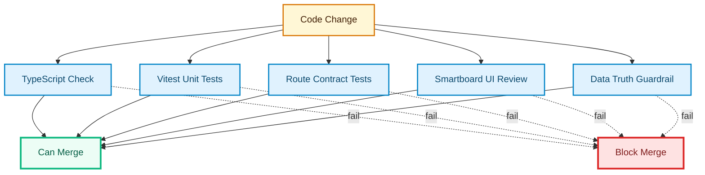

### Required Validation

| Area              | Minimum Check                                                         |
| ----------------- | --------------------------------------------------------------------- |
| Type safety       | TypeScript strict must not break                                      |
| Overview contract | adapter and contract must not mismatch                                |
| Intelligence      | scoring and priorities must remain deterministic                      |
| API routes        | auth/session/role checks must not rely on middleware alone            |
| Empty state       | missing data must be displayed honestly                               |
| AI output         | must be role-aware and context-bound                                  |
| UI                | Smartboard remains the primary surface, not a generic admin dashboard |

---

## Security and Data Boundary

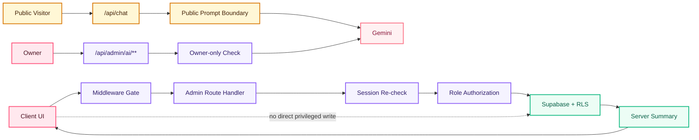

Principles:

- Middleware protects `/admin/*` and `/api/admin/*`.
- Route handlers still re-check session.
- The owner role is required for sensitive features such as owner AI, reports,
  and branch switching.
- Smartboard reads outlet summaries from the server summary route instead of
  making direct client-side claims.
- Generated Supabase types are the primary schema typing source.
- Server secrets must never enter the client bundle.

---

## Most Important Files

| File                                                                                                       | Why It Matters                     |
| ---------------------------------------------------------------------------------------------------------- | ---------------------------------- |
| [`components/admin/overview/overview-page-client.tsx`](components/admin/overview/overview-page-client.tsx) | main Sentra Smartboard shell       |
| [`components/admin/overview/overview-chat-panel.tsx`](components/admin/overview/overview-chat-panel.tsx)   | owner/staff consultation panel     |
| [`lib/admin/overview/intelligence.ts`](lib/admin/overview/intelligence.ts)                                 | scoring, priorities, stock risk    |
| [`lib/admin/overview/outlet-contracts.ts`](lib/admin/overview/outlet-contracts.ts)                         | Smartboard data contract           |
| [`lib/admin/overview/outlet-adapter.ts`](lib/admin/overview/outlet-adapter.ts)                             | maps summary into Smartboard shape |
| [`app/api/admin/overview/summary/route.ts`](app/api/admin/overview/summary/route.ts)                       | main dashboard data loader         |
| [`app/api/admin/ai/chat/route.ts`](app/api/admin/ai/chat/route.ts)                                         | owner AI chat                      |
| [`app/api/admin/ai/summary/route.ts`](app/api/admin/ai/summary/route.ts)                                   | owner AI summary                   |
| [`app/api/admin/ai/memory/route.ts`](app/api/admin/ai/memory/route.ts)                                     | AI memory inbox                    |
| [`components/admin/pages/AIView.tsx`](components/admin/pages/AIView.tsx)                                   | full AI workspace                  |
| [`components/admin/Sidebar.tsx`](components/admin/Sidebar.tsx)                                             | admin navigation                   |
| [`components/admin/Topbar.tsx`](components/admin/Topbar.tsx)                                               | top-level admin context            |

---

## Product Truth Principles

Semayot Smartboard is intentionally governed by these product rules:

1. **Do not invent numbers.** If data is missing, show an empty state.
2. **Separate real data, deterministic inference, and generative output.**
3. **Deterministic intelligence is the backbone of the decision layer.** LLMs
   explain, summarize, and support dialogue.
4. **Owner AI is a business copilot, not a replacement for owner judgment.**
5. **Public and admin surfaces may share a codebase, but their context and
   guardrails must stay different.**
6. **Smartboard must be actionable.** Every important signal should lead to a
   next action.
7. **Unknown is safer than a fake number.**
8. **The command center must be concise, honest, and fast to read.**

---

## Current Product Center of Gravity

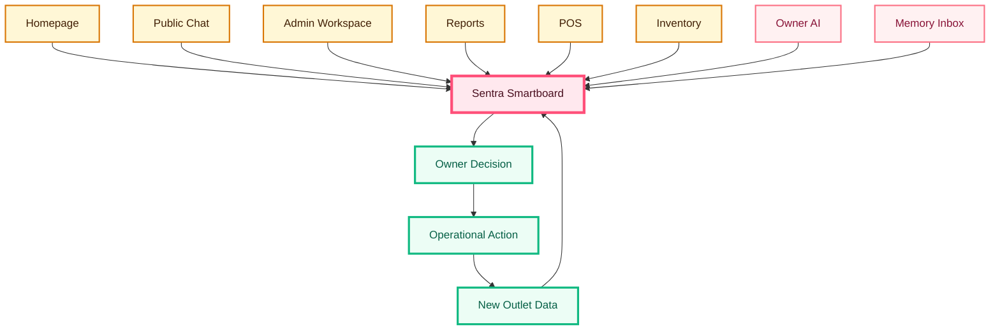

To understand Semayot today, do not start from the homepage.

Start from **Sentra Smartboard**.

That is where all important decisions converge:

- operational numbers
- outlet health
- stock risk
- cashier closing
- daily priorities
- AI summaries
- owner conversation with SEMA
- follow-up action into inventory, cashier, reports, and AI workspace

---

## LET'S CONNECT

<p align="center">
  <a href="https://discord.gg/1511829076313374745"></a>
  <a href="https://linkedin.com/in/dr-ferdi-iskandar-1b620a3b5"></a>
  <a href="https://medium.com/@ferdiiskandarse"></a>
  <a href="https://quora.com/profile/drferdiiskadar@gmail.com"></a>
  <a href="https://reddit.com/user/SixCupaCoffee"></a>
  <a href="https://tiktok.com/@drferdii"></a>
  <a href="https://x.com/ClaudesyI81047"></a>
  <a href="mailto:drferdiiskadar@gmail.com"></a>
</p>

---

## INSTRUMENTATION

<p align="center">
  
  
  
  
  
  
  
  
  
  
  
  
  
  
  
</p>

<div align="center">

### Sentra Smartboard Semayot

**Operational intelligence. Honest data. Actionable daily command.**

</div>
